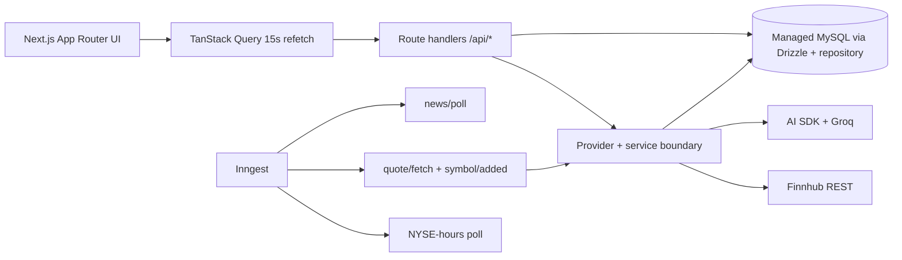

# Pulse

Pulse is a real-time market analytics and AI insights desk for an investor watchlist. It uses **Next.js 16, Better Auth, Drizzle ORM, managed MySQL, Inngest, Finnhub, AI SDK, Groq, TanStack Query, and Recharts**.

## Live MVP

The application is provider-backed by default. With the configured keys it supports:

- Better Auth email/password sessions backed by MySQL, plus optional Google OAuth.
- Finnhub symbol search, quote retrieval, company profiles, and seven-day company news.
- Persistent per-user watchlists: search a symbol, click **Add**, and the symbol is stored with its quote, snapshots, news, and profile.
- 15-second watchlist refresh through TanStack Query.
- Symbol detail pages with stored snapshot chart, profile, latest news, and manual structured Groq insight generation.
- Inngest functions for market-hour polling, quote fetches, symbol bootstrap, news cadence, retries, throttling, and five-minute insight debouncing.
- Explicit quote freshness and the disclaimer: **AI-generated, not financial advice.**

`PULSE_DEMO_MODE` is **not enabled by default**. It is available only when deliberately set to `true` for a fixture-only preview; otherwise missing provider credentials produce a clear setup state instead of fabricated market data.

## Architecture



## Run locally

```bash
pnpm install
cp .env.example .env.local
pnpm db:push
pnpm dev
```

Run `pnpm typecheck`, `pnpm lint`, `pnpm build`, and `pnpm db:check` before delivery. The app creates its small `pulse_*` ingestion tables on first repository access and the Drizzle schema creates Better Auth and the canonical application tables.

## Environment

| Variable | Purpose |
| --- | --- |
| `DATABASE_URL` | Managed MySQL connection string |
| `BETTER_AUTH_SECRET` | Random session-signing secret, at least 32 characters |
| `FINNHUB_API_KEY` | Live quotes, search, company profiles, and news |
| `GROQ_API_KEY` | Structured AI insight generation; current model is `openai/gpt-oss-120b` |
| `INNGEST_EVENT_KEY` | Inngest event delivery |
| `INNGEST_SIGNING_KEY` | Inngest route verification |
| `GOOGLE_CLIENT_ID` / `GOOGLE_CLIENT_SECRET` | Optional Google sign-in |
| `NEXT_PUBLIC_APP_URL` | Canonical auth callback URL |
| `PULSE_DEMO_MODE` | Optional explicit fixture mode; leave unset/false for real data |

Never commit `.env.local` or provider secrets. Preview sessions use `SameSite=None; Secure` cookies for the cross-site HTTPS iframe.

## Routes

- `/` — product overview
- `/login`, `/signup` — real Better Auth entry points
- `/dashboard` — per-user live watchlist workspace
- `/dashboard/:symbol` — chart, profile, news, and AI insight detail
- `/api/search?q=` — live Finnhub symbol search
- `/api/watchlist` — persistent list/add operations
- `/api/watchlist/:symbol` — persistent removal
- `/api/quotes?symbols=` — latest live quote payload
- `/api/symbols/:symbol` — symbol detail payload
- `/api/symbols/:symbol/insight` — manual Groq insight refresh
- `/api/auth/[...all]` — Better Auth handler
- `/api/inngest` — Inngest serve handler

## V2 extension points

The schema includes alerts and the service boundaries are ready for price alerts, daily digest generation, SMA20/50 and RSI, SSE streaming, watchlist sharing, CSV export, and paid-history fallbacks.

> Pulse is a research interface, not an investment recommendation.
